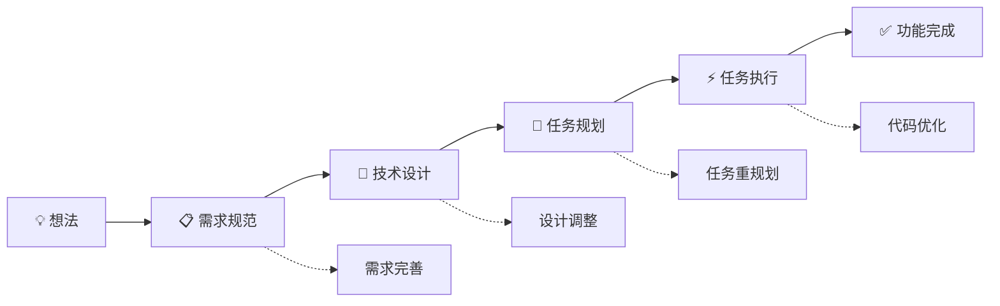
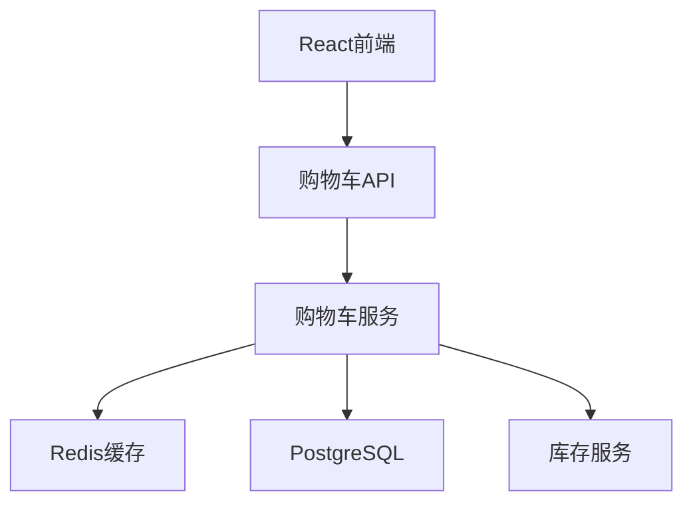

# Kiro 开发助手 - 完整指南

Kiro 是一个智能的开发助手生态系统，通过专业化的 AI agents 协作，为您提供从想法到实现的完整开发支持。

## 🚀 快速开始

### 基本使用
```bash
/kiro 我想开发一个用户认证系统
```

Kiro 会自动：
1. 分析您的需求意图
2. 选择合适的专家角色
3. 引导您完成结构化开发流程

### 核心命令
```bash
/kiro:spec 功能名      # 创建功能规范
/kiro:design 功能名    # 设计技术架构  
/kiro:task 功能名      # 规划实施任务
/kiro:execute 功能名   # 执行具体任务
/kiro:vibe 问题        # 快速开发协助

/kiro-status          # 查看项目状态
/kiro-status continue # 继续中断的工作
```

## 🎯 专家角色和工作流

### 专家角色介绍

#### 🎯 kiro-router (智能路由器)
**专长**：智能分析和路由决策
- 理解用户意图和项目上下文
- 自动选择最合适的专家角色
- 处理工作流中断和恢复

#### 📋 kiro-spec-creator (规范创建专家)
**专长**：从想法到完整规范的结构化流程
- 需求收集和整理
- 用户故事编写
- 验收标准定义
- 技术约束识别

**使用场景**：新功能开发、需求不清晰时、项目启动阶段

#### 🎨 kiro-feature-designer (功能设计专家)  
**专长**：基于需求创建技术设计
- 系统架构设计
- 组件接口定义
- 数据模型设计
- 技术选型决策

**使用场景**：需求明确后的技术设计、架构重构规划、技术方案选择

#### 📝 kiro-task-planner (任务规划专家)
**专长**：将设计转换为可执行任务
- 任务分解和优先级
- 增量式开发计划
- 测试驱动的任务设计
- 依赖关系管理

**使用场景**：设计完成后的实施规划、开发任务管理、进度跟踪需求

#### ⚡ kiro-task-executor (任务执行专家)
**专长**：聚焦实施特定任务
- 精确的代码实现
- 最小化功能开发
- 质量验证
- 渐进式构建

**使用场景**：具体编码任务、功能模块实现、代码质量优化

#### 🤝 kiro-assistant (快速助手)
**专长**：即时开发协助
- 快速问题解答
- 简单任务处理
- 调试和修复
- 技术咨询

**使用场景**：日常开发问题、快速原型制作、错误修复、技术查询

#### 📊 kiro-state-manager (状态管理器)
**专长**：项目状态维护和协调
- 维护项目状态和进度
- 管理工作流中断和恢复
- 提供状态查询和报告

### 标准开发流程


### 智能路由决策
Kiro 会根据您的输入和项目状态自动选择最合适的专家：

- **关键词分析**：识别"设计"、"规范"、"任务"等意图
- **项目状态**：检查现有文档和进度
- **上下文恢复**：智能恢复中断的工作
- **用户偏好**：学习您的开发习惯

## 📊 项目状态管理

### 查看项目状态
```bash
/kiro-status                # 全项目概览
/kiro-status 功能名         # 特定功能状态
/kiro-status --detailed     # 详细状态报告
```

### 工作流控制
```bash
/kiro-status continue       # 继续中断的工作
/kiro-status switch 功能名   # 切换功能
/kiro-status next           # 执行建议操作
```

## 🎯 完整开发示例 - 电商购物车

### 第一步：需求规范创建
```bash
用户输入: /kiro 我需要开发一个电商购物车功能
```

**Kiro 智能路由**：
- 检测到新功能开发需求
- 识别关键词"开发"、"功能"  
- 路由到 `kiro-spec-creator`

**交互过程**：
```markdown
📋 需求收集阶段

我来帮您创建购物车功能的完整规范。

首先，让我了解一些基本信息：
1. 这是B2C还是B2B电商？
2. 需要支持哪些购物车特性？（保存、分享、多设备同步等）
3. 预期的并发用户数量？
4. 有特殊的业务规则吗？

基于您的回答，我将创建：
.kiro/specs/shopping-cart/requirements.md
```

**生成文档结构**：
```markdown
# 购物车功能需求文档

## 功能概述
用户可以将商品添加到购物车，管理商品数量，计算总价，并进行结算。

## 用户故事

### US-1: 添加商品到购物车
**作为** 用户
**我想要** 将喜欢的商品添加到购物车
**以便** 稍后购买或比较

#### 验收标准
1. WHEN 用户点击"加入购物车"按钮 THEN 系统应该将商品添加到购物车
2. IF 商品已在购物车中 THEN 系统应该增加数量而不是重复添加
3. WHEN 添加成功 THEN 系统应该显示确认信息

[... 更多用户故事]
```

### 第二步：技术设计
```bash
用户选择: /kiro:design shopping-cart
```

**设计过程**：
```markdown
🎨 技术设计阶段

基于购物车功能需求，我将进行技术研究和架构设计。

研究领域：
1. 购物车数据存储策略 (Session vs Database vs Redis)
2. 高并发下的库存管理
3. 购物车状态同步机制
4. 性能优化方案
```

**生成设计文档**：
```markdown
# 购物车功能技术设计

## 系统架构

### 组件关系图


### 核心组件
```typescript
interface CartService {
  addItem(userId: string, item: CartItem): Promise<Cart>
  removeItem(userId: string, itemId: string): Promise<Cart>
  updateQuantity(userId: string, itemId: string, quantity: number): Promise<Cart>
  getCart(userId: string): Promise<Cart>
}
```
```

### 第三步：任务规划
```bash
用户选择: /kiro:task shopping-cart
```

**生成任务列表**：
```markdown
# 购物车功能实施计划

## 任务列表

- [ ] 1. 设置项目基础结构
  - 创建购物车相关目录结构
  - 配置TypeScript类型定义
  - 设置测试环境

- [ ] 2. 实现数据模型和验证
  - [ ] 2.1 创建购物车数据模型
  - [ ] 2.2 实现Redis存储层

- [ ] 3. 开发核心业务逻辑
  - [ ] 3.1 实现购物车服务类
  - [ ] 3.2 添加商品到购物车功能

[... 更多任务]
```

### 第四步：任务执行
```bash
用户选择: /kiro:execute shopping-cart 1
```

**执行过程**：
```markdown
⚡ 任务执行阶段

正在执行任务1: "设置项目基础结构"

读取任务规范...
检查现有代码结构...
开始实施...
```

**生成代码**：
```typescript
// src/types/cart.ts
export interface CartItem {
  id: string;
  productId: string;
  name: string;
  price: number;
  quantity: number;
  imageUrl: string;
}

export interface Cart {
  id: string;
  userId: string;
  items: CartItem[];
  totalItems: number;
  totalPrice: number;
  createdAt: Date;
  updatedAt: Date;
}

// src/services/CartService.ts
export class CartService {
  async addItem(userId: string, item: CartItem): Promise<Cart> {
    const cart = await this.getCart(userId);
    const existingItem = cart.items.find(i => i.productId === item.productId);
    
    if (existingItem) {
      existingItem.quantity += item.quantity;
    } else {
      cart.items.push(item);
    }
    
    await this.updateCart(cart);
    return cart;
  }
}
```

### 第五步：状态跟踪
```bash
用户查询: /kiro-status shopping-cart
```

**状态展示**：
```markdown
🛒 购物车功能 详细状态
=======================
当前阶段: 实施进行中 🔄
进度: 25% (1/4 阶段，当前阶段25%完成)

阶段状态:
✅ 需求收集     完成于 今天 09:30
✅ 架构设计     完成于 今天 11:15  
🔄 任务实施     进行中 (25% 完成)
⏳ 功能测试     等待开始

当前任务: 2.1 创建购物车数据模型
已完成: 1个任务
剩余: 11个任务

建议操作:
1. /kiro:execute shopping-cart 2.1  (继续当前任务)
2. /kiro:task shopping-cart --review (重新查看任务列表)
```

## 🔄 工作流中断与恢复

### 中断恢复示例
```bash
# 用户2小时后返回
用户: /kiro
```

**智能恢复提示**：
```markdown
👋 欢迎回来！检测到进行中的工作：

🛒 购物车功能 (实施阶段 25% 完成)  
   ⏰ 2小时前中断于'创建购物车数据模型'

中断状态: 已完成项目结构设置，正在进行数据模型定义
中断位置: TypeScript接口定义阶段

恢复选项:
1. 🔄 继续数据模型任务 (推荐)
2. 📋 重新查看任务列表
3. 🎨 调整技术设计  
4. 🆕 开始新功能

建议: 继续完成数据模型，只剩验证函数部分了 👍
```

### 多功能项目管理
```bash
用户: /kiro-status
```

**项目概览**：
```markdown
📊 电商项目状态概览
==================
活跃功能: 购物车功能  
总体进度: 60% (平均)

功能列表:
✅ 用户认证系统    [已完成] → 可用于其他功能
🔄 购物车功能      [实施25%] → 建议: 继续数据模型任务
📋 支付系统        [设计完成] → 建议: 开始任务规划  
⏳ 订单管理        [需求完成] → 建议: 开始技术设计

技术栈: Node.js, React, PostgreSQL, Redis
项目类型: 电商平台 (中等复杂度)

快捷操作:
• /kiro-status continue        (继续购物车开发)
• /kiro:task payment-system    (规划支付任务)  
• /kiro:design order-mgmt      (设计订单管理)
```

## 🎨 使用技巧与最佳实践

### 1. 让 Kiro 了解您的偏好
首次使用时明确您的技术栈：
```bash
/kiro:spec 用户系统 --stack "Node.js, React, PostgreSQL"
```

### 2. 利用中断恢复功能
Kiro 会自动检测中断的工作并提供恢复选项：
```
⚠️ 检测到中断工作
上次在设计'支付系统'时中断了(2小时前)
建议：继续完成API设计部分
```

### 3. 分阶段开发
不必一次完成所有内容，Kiro 支持分阶段迭代：
- 先完善需求，获得用户确认
- 再进行技术设计，确定架构
- 然后制定任务计划
- 最后逐步执行实现

### 4. 多功能项目管理
对于复杂项目，使用状态管理：
```bash
/kiro-status                     # 查看所有功能
/kiro-status switch payment         # 切换到支付模块
/kiro:design payment                # 设计支付架构
/kiro-status switch user-auth       # 切换回用户认证
```

## 🛠️ 高级功能特性

### 状态持久化
- 所有工作进度自动保存在 `.kiro/specs/` 目录
- 支持工作中断和恢复
- 维护完整的决策历史

### 智能上下文传递
- Agent 间自动传递项目上下文
- 保持技术决策的一致性
- 避免重复信息收集

### 协作友好
- 清晰的文档结构
- 标准化的输出格式
- 易于团队分享和协作

## 📚 最佳实践

### 需求先行
```bash
# 好的做法
/kiro:spec 用户认证系统
# 等需求明确后再进行设计

# 避免的做法  
/kiro:design 用户系统  # 需求不明确直接设计
```

### 迭代式开发
```bash
# 分阶段进行
/kiro:spec user-auth     # 第一步：明确需求
/kiro:design user-auth   # 第二步：技术设计
/kiro:task user-auth     # 第三步：任务规划
/kiro:execute user-auth  # 第四步：逐步实现
```

### 保持专注
- 一次专注一个功能的开发
- 避免同时进行多个复杂任务
- 利用状态管理切换工作重点

### 充分利用反馈
- 在每个阶段都给出明确反馈
- 不满意时要求重新设计
- 积极参与决策过程

## 🔧 故障排除

### 常见问题

**Q: Kiro 选择了错误的专家角色？**  
A: 可以明确指定角色：`/kiro:design 功能名` 而不是 `/kiro 功能名`

**Q: 工作流程中断了怎么办？**  
A: 使用 `/kiro-status continue` 继续中断的工作，或 `/kiro-status` 查看状态

**Q: 想要重新开始某个阶段？**  
A: 使用 `/kiro-reset 功能名 阶段名` 或直接重新调用对应专家

**Q: 如何查看项目整体进度？**  
A: 使用 `/kiro-status` 获得完整项目概览

### 获取帮助
```bash
/kiro:vibe 怎么使用这个功能？
/kiro-status --help
```

## 📈 效益总结

**通过 Kiro 获得的价值**：

1. **结构化开发**: 从想法到实现的完整流程指导
2. **质量保证**: 每个阶段的明确验收标准  
3. **进度透明**: 实时状态跟踪和可视化进度
4. **智能协作**: AI agents 间的无缝协作
5. **知识积累**: 完整的文档和决策历史
6. **灵活适应**: 支持中断恢复和迭代调整

**开发效率提升**：
- 需求阶段: 减少50%的来回沟通
- 设计阶段: 标准化的技术决策流程  
- 实施阶段: 清晰的任务分解和追踪
- 测试阶段: 预定义的验收标准

---

🎉 现在您已经掌握了 Kiro 的完整使用方法！开始您的第一个项目：

```bash
/kiro 我想开发一个 [您的项目想法]
```

## 📚 相关文档

- **[GUIDE.md](./GUIDE.md)** - 快速入门指南
- **[USER-MANUAL.md](./USER-MANUAL.md)** - 详细使用手册  
- **[README.md](./README.md)** - 系统完整说明
- **[BMAD-PILOT-GUIDE.md](./BMAD-PILOT-GUIDE.md)** - BMAD AI团队方法论指南