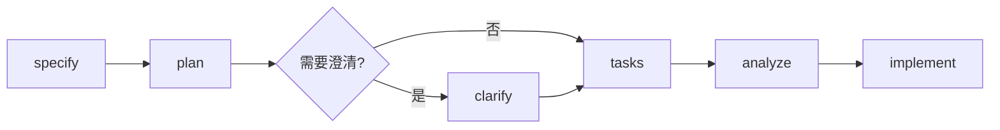

# Claude Code 智能开发工作流系统

[](https://opensource.org/licenses/MIT)
[](https://claude.ai/code)

> 精简高效的Claude Code工作流系统，让AI助手更懂你的开发需求

## 🎯 是什么？

一个为Claude Code优化的智能辅助系统，通过 **Spec-Kit 规范驱动开发** + **20+核心命令** + **5个专业角色**，将复杂的开发任务转化为可信任的自动化工作流。

### 核心特性

- **📋 Spec-Kit 规范驱动** - 从需求到实施的完整文档化工作流（⭐️ 推荐）
- **🚀 三大工作流** - 覆盖从快速原型到专业开发的全场景
- **🛠️ 精简命令集** - 20+个核心命令解决90%开发需求
- **👥 专业角色** - 5个AI专家角色自动协作
- **🎛️ 智能路由** - 自动判断问题类型并调用合适工具
- **📊 质量门控** - 实用的自动化质量保证机制

## ⚡ 快速开始

### 安装

```bash
# 克隆到用户配置目录（推荐）
git clone https://github.com/ysicing/code-pilot.git ~/.claude

# 或克隆到项目目录
git clone https://github.com/ysicing/code-pilot.git .claude

# 使用示例配置
cd .claude
cp CLAUDE.md.example CLAUDE.md
```

### 一分钟上手

#### ⭐️ 推荐：Spec-Kit 规范驱动开发

```bash
# 1. 创建功能规格 - 从自然语言描述生成规范文档
/spec-kit:specify "用户认证系统，支持邮箱和手机登录"

# 2. 澄清细节 - 交互式完善需求（可选）
/spec-kit:clarify

# 3. 规划实施 - 生成技术设计和架构文档
/spec-kit:plan

# 4. 生成任务 - 创建可执行的任务清单
/spec-kit:tasks

# 5. 分析质量 - 验证文档一致性
/spec-kit:analyze

# 6. 执行实施 - 按任务清单自动实现
/spec-kit:implement
```

**Spec-Kit 优势：**
- ✅ 完整的需求文档化流程
- ✅ 结构化的技术设计文档
- ✅ 可追溯的任务管理
- ✅ 自动化的质量检查
- ✅ 适合中大型功能开发

#### 其他快速工作流

```bash
# 快速开发 - 适合日常功能开发
/requirements-pilot "实现用户注册登录功能"

# 规范驱动 - 适合复杂系统设计
/kiro "设计多租户SaaS系统架构"

# 专业开发 - 适合精细化控制
/zcf-workflow "开发在线教育平台"
```

## 📋 Spec-Kit：规范驱动开发工具集

### 完整工作流



### 命令详解

| 命令 | 功能 | 适用场景 |
|------|------|----------|
| **/spec-kit:specify** | 创建功能规格文档 | 将自然语言需求转为结构化规格 |
| **/spec-kit:clarify** | 交互式需求澄清 | 消除歧义、补充细节 |
| **/spec-kit:plan** | 生成实施计划 | 技术栈选型、架构设计、数据模型 |
| **/spec-kit:tasks** | 生成任务清单 | 将计划拆解为可执行任务 |
| **/spec-kit:analyze** | 文档质量分析 | 检查一致性、完整性 |
| **/spec-kit:implement** | 执行实施 | 按任务清单自动编码 |
| **/spec-kit:constitution** | 项目宪章管理 | 定义项目原则和约束 |

### 使用示例

```bash
# 完整流程示例
/spec-kit:specify "电商购物车功能：支持添加商品、修改数量、应用优惠券、计算总价"

# 系统会自动：
# 1. 创建功能分支
# 2. 生成 spec.md 规格文档
# 3. 等待你继续执行 /spec-kit:plan

/spec-kit:plan

# 生成设计文档：
# - plan.md: 技术栈和架构
# - data-model.md: 数据模型
# - contracts/: API接口定义
# - research.md: 技术调研
```

## 📋 三大核心工作流

| 工作流 | 适用场景 | 特点 |
|--------|----------|------|
| **Spec-Kit** ⭐️ | 中大型功能、需要文档化 | 规范驱动、完整追溯 |
| **Requirements-Pilot** | 日常开发、快速原型 | 端到端自动化、快速交付 |
| **Kiro** | 复杂功能、需要规范 | 结构化设计、完整文档 |
| **ZCF-Workflow** | 专业开发 | 六阶段流程、精细控制 |

## 🛠️ 核心命令

> 按使用频率排序

### 📋 Spec-Kit 工具集（推荐）
- `/spec-kit:specify` - 创建功能规格
- `/spec-kit:clarify` - 需求澄清
- `/spec-kit:plan` - 生成实施计划
- `/spec-kit:tasks` - 任务生成
- `/spec-kit:analyze` - 质量分析
- `/spec-kit:implement` - 执行实施
- `/spec-kit:constitution` - 项目宪章

### 🔍 分析工具
- `/ask` - 架构咨询
- `/plan` - 实施规划
- `/ultrathink` - 深度分析
- `/story-breakdown` - 功能分解

### 💻 开发工具
- `/code` - 功能实现
- `/optimize` - 性能优化
- `/refactor` - 代码重构
- `/bugfix` - 缺陷修复
- `/debug` - 深度调试

### ✅ 质量保证
- `/review` - 代码审查
- `/test` - 测试策略

### 🤖 工作流工具
- `/requirements-pilot` - 需求驱动开发
- `/kiro` - 规范驱动开发
- `/zcf-workflow` - 六阶段工作流

## 👥 专业角色

系统内置5个专业AI角色，自动根据问题类型协作：

- **architect** - 系统架构师
- **security** - 安全专家
- **performance** - 性能专家
- **frontend** - 前端专家
- **reviewer** - 代码审查专家

## 📚 文档

- **[GUIDE.md](./GUIDE.md)** - 完整使用指南和详细示例
- **[CLAUDE.md.example](./CLAUDE.md.example)** - 配置文件示例

## 🎯 设计理念

- **规范驱动** - 通过Spec-Kit实现需求到代码的完整追溯
- **KISS原则** - 保持简单，避免过度工程化
- **实用主义** - 解决实际问题优先于追求完美
- **智能化** - 让AI自动处理繁琐决策
- **质量平衡** - 实用的质量标准，不追求极致

## 🆕 最新更新

### v2.0.0 (2025-11-12)
- ✨ 新增 Spec-Kit 规范驱动开发工具集
- ✨ 新增 Codex 技能支持
- 🔧 优化命令结构和文档组织
- 📝 更新项目 manifest 元数据

查看完整更新日志：[CHANGELOG.md](./CHANGELOG.md)

## 📄 许可证

MIT License - 详见 [LICENSE](./LICENSE) 文件

## 🙏 致谢

本项目基于 [myclaude](https://github.com/cexll/myclaude) 进行优化增强，感谢原作者的开创性工作。

---

**更多详情请查看 [完整使用指南](./GUIDE.md)**
