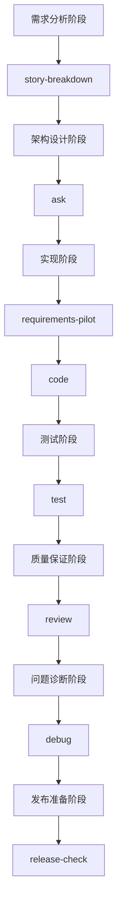

# 开发阶段工具使用指南

## 🎯 **核心理念**
- **质量门控自动化**：用客观标准替代主观判断
- **专业化分工**：每个工具专注一个领域，避免万能工具
- **轻量级流程**：保持简单，专注核心价值

## 📊 **工具与阶段映射**



## 🔄 **阶段详细指南**

### 📋 **阶段1：需求分析** 
**目标**：将模糊需求转化为可实现的用户故事

#### 使用工具：`/story-breakdown`
```bash
# 使用场景
/story-breakdown "用户管理系统，包括注册、登录、权限管理"

# 输出价值
✅ 将大需求拆分为1-3天可完成的小故事
✅ 每个故事有明确验收标准
✅ 提供实现优先级和依赖关系
✅ 开发团队可直接开始实现
```

**质量门控**：
- 每个故事都有明确的验收标准
- 故事大小适中（1-3天完成）
- 故事之间依赖关系清晰

---

### 🏛️ **阶段2：架构设计**
**目标**：在实现前明确技术方案和潜在风险

#### 使用工具：`/ask`
```bash
# 使用场景
/ask "高并发用户系统的架构设计考虑"
/ask "微服务vs单体架构在当前项目的选择"

# 输出价值  
✅ 4专家团队提供全方位分析
✅ 技术选型的优缺点对比
✅ 潜在风险识别和缓解方案
✅ 纯思考阶段，不产生代码
```

**质量门控**：
- 技术方案清晰可行
- 主要风险已识别
- 团队对方案达成共识

---

### ⚡ **阶段3：快速实现**
**目标**：将需求快速转化为工作代码

#### 使用工具：`/requirements-pilot` (推荐) 或 `/code`

##### 🎯 自动化流水线（推荐）
```bash
# 完整自动化流程
/requirements-pilot "用户注册功能" --test

# 自动执行流程
需求确认(90+分) → 用户批准 → 代码实现 → 质量审查(90+) → 测试
```

##### 🔧 手动实现
```bash
# 直接实现特定功能
/code "实现JWT认证中间件"
```

**质量门控**：
- 需求清晰度评分90+
- 代码质量评分90+
- 核心功能可验证

---

### 🧪 **阶段4：测试验证**
**目标**：确保代码满足业务需求

#### 使用工具：`/test`
```bash
# 创建测试策略
/test "用户认证模块"

# 智能测试决策
- UI变更：仅lint检查
- 业务逻辑：全面测试
- 1-5行修改：比例化测试
```

**质量门控**：
- 核心业务逻辑有测试覆盖
- 重要边界条件已验证
- 测试执行通过

---

### 🔍 **阶段5：质量保证**
**目标**：确保代码达到生产标准

#### 使用工具：`/review`
```bash
# 多维度代码审查
/review "用户管理模块"

# 4专家审查
✅ 质量审计员：代码规范、可维护性
✅ 安全分析师：漏洞、权限控制  
✅ 性能审查员：性能瓶颈、优化点
✅ 架构评估员：设计模式、扩展性
```

**质量门控**：
- 代码质量评分90+
- 安全风险可控
- 性能满足要求

---

### 🐛 **阶段6：问题诊断** 
**目标**：系统化解决出现的问题

#### 使用工具：`/debug`
```bash
# UltraThink调试流程
/debug "生产环境响应超时"

# 4阶段调试
问题分析 → 多专家协作 → 假设精炼 → 用户确认 → 实施修复
```

**质量门控**：
- 问题根因已确定
- 修复方案经过验证
- 用户确认后才实施

---

### 🚀 **阶段7：发布准备**
**目标**：确保系统生产就绪

#### 使用工具：`/release-check`
```bash
# 生产就绪检查
/release-check "用户管理系统"

# 核心检查点
✅ 核心功能正常
✅ 错误处理完善
✅ 监控日志就绪
✅ 回滚方案准备
```

**质量门控**：
- 生产就绪检查通过
- 回滚方案确认
- 监控告警配置

---

## 🔀 **灵活使用模式**

### 模式1：完整流程（新功能开发）
```bash
story-breakdown → ask → requirements-pilot → review → release-check
```

### 模式2：快速修复（Bug处理）
```bash
debug → code → review → release-check
```

### 模式3：架构优化（重构场景）
```bash
ask → code → test → review → release-check
```

### 模式4：一键完成（简单功能）
```bash
requirements-pilot（包含所有子流程）
```

## 💡 **使用建议**

### 新团队建议
1. **先用requirements-pilot**：完整体验自动化流程
2. **熟悉后拆解**：根据需要使用单独命令
3. **建立标准**：团队统一质量门控标准

### 复杂项目建议
1. **需求阶段必用**：story-breakdown + ask
2. **实现阶段灵活**：简单用requirements-pilot，复杂用code
3. **质量把控严格**：review + release-check必须过关

### 维护项目建议
1. **问题优先**：debug定位问题
2. **快速修复**：code直接实现
3. **质量保证**：review确保不引入新问题