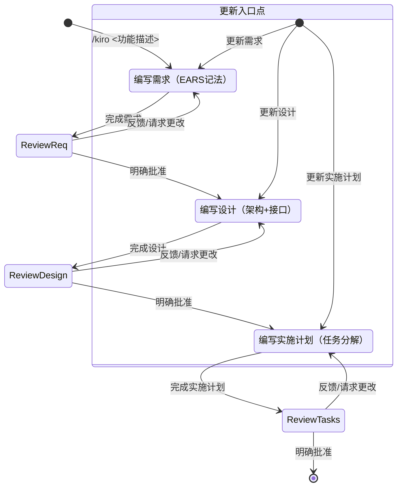
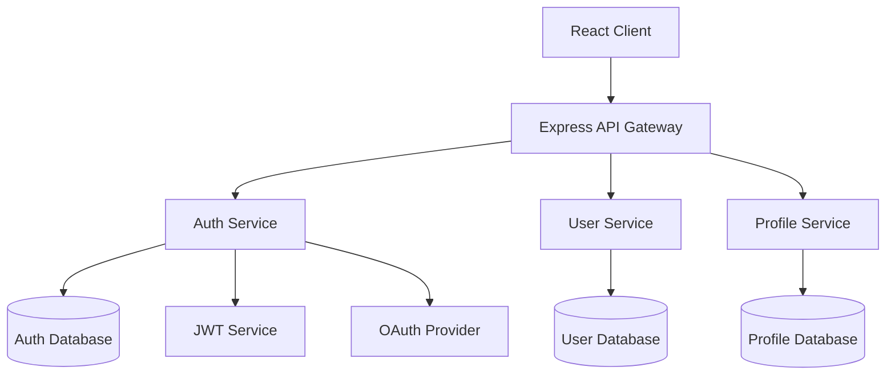

## Kiro 规范驱动开发

**「在编写代码之前赋予结构」** - 通过分阶段对话工作流，将想法转化为详细的功能规范

与传统代码生成工具不同，Kiro 实现规格驱动开发，重点是为开发的混沌赋予结构。从最少的需求输入，逐步展开到产品经理级别的详细规格和可实施的设计，**从原型到生产环境**保证一致的质量。

### 使用方法

```bash
/kiro <功能描述>
```

例如：

```bash
# 基础功能规范
/kiro 用户认证系统，支持JWT和OAuth

# 复杂功能规范  
/kiro 电商购物车功能，包括商品管理、价格计算、优惠券支持

# API 设计规范
/kiro RESTful API设计，包括认证、验证、错误处理
```

### 基本示例

```bash
# 新功能的规范创建（最少输入）
/kiro 商品评论系统
- 星级评分功能
- 评论发布
- 图片上传

# 系统功能的规范创建
/kiro 用户认证
- OAuth 支持
- 多因素认证

# API 功能的规范创建
/kiro 支付系统 API
- Stripe 集成
- 重视安全性
```

### 与 Claude 的协作

```bash
# 复杂功能规范
/kiro 聊天功能的规范。包括 WebSocket、实时通知、历史管理

# 数据库关联功能规范
/kiro 电商网站库存管理功能的规范。包括商品添加、库存更新、警报功能

# 前端功能规范
/kiro React 仪表板的规范。包括图表显示、筛选器、导出功能

# 后端功能规范
/kiro RESTful API 的规范。包括认证、验证、日志记录
```

## Kiro 工作流程

### 3 阶段交互式展开

Kiro 遵循严格的分阶段工作流程，确保每个阶段都得到充分讨论和确认：

#### 阶段 1: Requirements Discovery（需求发现）
- **目标**: 从粗略想法生成详细的用户故事和验收标准
- **输出**: `.claude/specs/{feature_name}/requirements.md`
- **特点**: 使用 EARS 记法的结构化需求描述

#### 阶段 2: Design Exploration（设计探索）  
- **目标**: 基于需求创建全面的技术设计文档
- **输出**: `.claude/specs/{feature_name}/design.md`
- **特点**: 包含架构图、接口设计、数据模型

#### 阶段 3: Implementation Planning（实施规划）
- **目标**: 制定详细的实施计划和任务分解
- **输出**: `.claude/specs/{feature_name}/tasks.md`
- **特点**: 包含质量检查点、风险缓解策略

### 详细工作流程

<workflow-definition>

# 功能规范创建工作流程

## 概述

您正在帮助引导用户完成将功能的粗略想法转化为详细设计文档的过程，包括实现计划和待办事项列表。它遵循规范驱动开发方法论，系统地细化您的功能想法，进行必要的研究，创建全面的设计，并制定可操作的实现计划。该过程设计为迭代式，允许在需求澄清和研究之间根据需要进行移动。

此工作流程的核心原则是我们依靠用户在进展过程中建立基本事实。我们始终希望确保用户对任何文档的更改感到满意，然后再继续前进。
  
在开始之前，根据用户的粗略想法想出一个简短的功能名称。这将用于功能目录。使用 kebab-case 格式作为 feature_name（例如 "user-authentication"）
  
规则：

- 当您完成文档并需要获取用户输入时，只需让用户知道，如详细步骤说明中所述

### 1. 需求收集

首先，基于功能想法生成一组 **EARS** 格式的初始需求，然后与用户迭代以完善它们，直到它们完整和准确。

在此阶段不要专注于代码探索。相反，只需专注于编写需求，这些需求稍后将转化为设计。

**约束条件：**

- 必须创建 '.claude/specs/{feature_name}/requirements.md' 文件（如果不存在）
- 必须基于用户的粗略想法生成需求文档的初始版本，无需首先询问顺序问题
- 必须使用以下格式格式化初始 requirements.md 文档：
- 总结功能的清晰介绍部分
- 分层编号的需求列表，每个包含：
  - 格式为 "作为 [角色]，我想要 [功能]，以便 [收益]" 的用户故事
  - EARS 格式（需求语法简易方法）的编号验收标准列表
- 示例格式：

```md
# 需求文档

## 介绍

[介绍文本在此]

## 需求

### 需求 1

**用户故事：** 作为 [角色]，我想要 [功能]，以便 [收益]

#### 验收标准
此部分应包含 EARS 需求

1. 当 [事件] 时，[系统] 应当 [响应]
2. 如果 [前置条件] 那么 [系统] 应当 [响应]
  
### 需求 2

**用户故事：** 作为 [角色]，我想要 [功能]，以便 [收益]

#### 验收标准

1. 当 [事件] 时，[系统] 应当 [响应]
2. 当 [事件] 且 [条件] 时，[系统] 应当 [响应]
```

- 应该在初始需求中考虑边缘情况、用户体验、技术约束和成功标准
- 更新需求文档后，模型必须使用 '<ask_followup_question>' 工具询问用户 "需求看起来好吗？如果是，我们可以继续进行设计。"
- '<ask_followup_question>' 工具必须使用确切字符串 'spec-requirements-review' 作为原因
- 如果用户请求更改或未明确批准，必须修改需求文档
- 每次编辑需求文档后都必须要求明确批准
- 在收到明确批准（如 "是"、"批准"、"看起来不错" 等）之前，不得进入设计文档
- 必须继续反馈-修订循环，直到收到明确批准
- 应该建议需求可能需要澄清或扩展的具体领域
- 可以询问需要澄清的需求特定方面的针对性问题
- 当用户对特定方面不确定时，可以建议选项
- 用户接受需求后必须进入设计阶段

### 2. 创建功能设计文档

用户批准需求后，您应该基于功能需求开发全面的设计文档，在设计过程中进行必要的研究。
设计文档应该基于需求文档，因此请确保它首先存在。

**约束条件：**

- 必须创建 '.claude/specs/{feature_name}/design.md' 文件（如果不存在）
- 必须识别基于功能需求需要研究的领域
- 必须进行研究并在对话线程中建立上下文
- 不应创建单独的研究文件，而是将研究用作设计和实现计划的上下文
- 必须总结将为功能设计提供信息的关键发现
- 应该引用来源并在对话中包含相关链接
- 必须在 '.claude/specs/{feature_name}/design.md' 创建详细的设计文档
- 必须将研究结果直接纳入设计过程
- 必须在设计文档中包含以下部分：

- 概述
- 架构
- 组件和接口
- 数据模型
- 错误处理
- 测试策略

- 应该在适当时包含图表或视觉表示（如果适用，使用 Mermaid 作为图表）
- 必须确保设计解决了在澄清过程中识别的所有功能需求
- 应该突出设计决策及其理由
- 可以在设计过程中就特定技术决策向用户征求意见
- 更新设计文档后，模型必须使用 '<ask_followup_question>' 工具询问用户 "设计看起来好吗？如果是，我们可以继续进行实现计划。"
- '<ask_followup_question>' 工具必须使用确切字符串 'spec-design-review' 作为原因
- 如果用户请求更改或未明确批准，必须修改设计文档
- 每次编辑设计文档后都必须要求明确批准
- 在收到明确批准（如 "是"、"批准"、"看起来不错" 等）之前，不得进入实现计划
- 必须继续反馈-修订循环，直到收到明确批准
- 在继续之前必须将所有用户反馈纳入设计文档
- 如果在设计过程中发现差距，必须提供返回功能需求澄清的选项

### 3. 创建实施计划文档

用户批准设计后，您应该创建详细的实施计划，包含任务分解、质量检查点和风险缓解策略。

**约束条件：**

- 必须创建 '.claude/specs/{feature_name}/tasks.md' 文件（如果不存在）
- 必须基于设计文档创建详细的实施计划
- 必须包含以下部分：
  - 任务分解（具体的实施步骤）
  - 优先级排序
  - 依赖关系分析
  - 质量检查点
  - 风险缓解策略
  - 时间估算（如果适用）
- 应该自动应用最佳实践和安全考虑
- 必须考虑现有代码库的约束和模式
- 更新实施计划后，模型必须使用 '<ask_followup_question>' 工具询问用户确认
- 用户批准后完成整个 Kiro 工作流程

- 不得尝试在此工作流程中实现功能
- 创建所有规范文件后，必须清楚地与用户沟通此工作流程已完成

</workflow-definition>

## 工作流程图

以下是描述工作流程应如何运行的 Mermaid 流程图：



## Kiro 特有功能

### EARS 记法 (Easy Approach to Requirements Syntax)

Kiro 使用标准的 EARS 记法模式来确保需求的清晰性和可测试性：

```markdown
# Kiro 标准的 EARS 记法模式

WHEN [情况・触发器]
GIVEN [前提条件]
THEN [系统行为]
AND [额外行为]

WHILE [状态・流程]
THE SYSTEM SHALL [必须行为]
AND [相关行为]

WHERE [功能・组件]
IS [条件・状态]
THE SYSTEM SHALL [对应行为]
```

### 自动生成功能

- **Mermaid 图**: 自动生成架构和数据流图
- **TypeScript 接口**: 基于设计自动创建类型定义
- **最佳实践**: 自动集成安全和性能对策
- **质量检查点**: 自动设置分阶段质量标准

### 实证效果（Kiro 实绩）

**2 天完成安全文件共享应用**
```bash
/kiro 文件共享系统（支持加密）
→ 2 天完成生产级别的加密文件共享应用
→ 自动应用安全最佳实践
→ 无需额外提示
```

**新手一晚开发游戏**
```bash
/kiro 2D 益智游戏
→ 游戏开发新手的开源开发者
→ 一晚完成游戏创建
→ 实现逻辑由 Kiro 处理，开发者专注创造性
```

**周末从原型到生产**
```bash
/kiro 电商网站商品管理系统
→ 一个周末从概念到可运行的原型
→ 从原型到生产环境的一致质量
→ 通过 spec-driven development 的结构化方法
```

## 分阶段对话示例

### Phase 1: Requirements Discovery & Discussion

**1. 从最少输入自动扩展（Kiro 式）**

```
用户：/kiro 用户管理系统
- 登录功能
- 个人资料编辑
- 管理员权限

Claude：从需求生成详细用户故事。
这个理解正确吗？

自动生成的用户故事：
- 用户注册和认证功能（支持 OAuth）
- 个人资料管理功能（头像、设置）
- 权限管理功能（RBAC）
- 密码重置功能
- 安全审计日志

已补充未明确的细节。还需要其他功能吗？
```

**2. 使用 EARS 记法的结构化需求描述**

```
Claude：使用 Kiro 的 EARS 记法结构化需求：

EARS 记法需求定义：

WHEN 用户尝试登录时
GIVEN 输入正确的邮箱和密码
THEN 系统确认认证
AND 成功时重定向到仪表板

WHILE 用户在个人资料编辑页面时
THE SYSTEM SHALL 实时执行验证
AND 预览显示更改内容

WHERE 需要管理员权限的功能
IS 尝试访问时
THE SYSTEM SHALL 确认权限级别
AND 不足时拒绝访问
```

### Phase 2: Design Exploration & Discussion

**1. 代码库分析 + 自动设计建议（Kiro 式）**

```
Claude：分析现有代码库，提出最佳架构：

代码库分析结果：
- 认证：JWT + Express.js（v4.18.x）
- 数据库：PostgreSQL（v14+）
- 前端：React + TypeScript（v18+）
- 现有模式：Repository 模式、Service 层分离

Kiro 推荐架构：
- 符合 Clean Architecture
- Domain-Driven Design 元素
- 部分应用 CQRS 模式
- 自动化的安全最佳实践

使用这个设计吗？
```

**2. 使用 Mermaid 图的可视化设计**



### Phase 3: Implementation Planning & Discussion

**1. 最佳实践自动应用（Kiro 式）**

```
Claude：生成了自动应用 Kiro 最佳实践的实施计划：

自动生成的实施策略：

1. 安全第一开发
   - 自动集成 OWASP Top 10 对策
   - 自动实现加密和哈希
   - 自动生成安全测试

2. 强制清洁架构
   - 自动实现层分离
   - 自动应用依赖倒置
   - 强制可测试设计

3. 性能优化
   - 自动实现缓存策略
   - 数据库优化
   - 利用异步处理

使用这个方法吗？
```

## 与其他工作流的区别

### /kiro vs /plan 对比

| 特征 | /kiro | /plan |
|------|-------|-------|
| **主要目标** | 功能规格驱动开发 | 一般实施计划制定 |
| **输出格式** | 3 个独立文件（requirements.md、design.md、tasks.md） | 单一计划文档 |
| **需求定义** | 使用 EARS 记法的详细验收标准 | 基本需求整理 |
| **设计深度** | 基于代码库分析的技术设计 | 以技术选型为中心 |
| **实施规划** | 考虑依赖关系的序列化任务 | 一般任务分解 |
| **质量保证** | 全面质量要求（测试、无障碍、性能） | 基本测试策略 |
| **工作流程** | 3阶段交互式对话 | 静态计划生成 |
| **确认机制** | 每阶段都需要明确批准 | 计划完成后等待批准 |

### 推荐使用场景

**推荐使用 /kiro**：
- 新功能开发
- 复杂功能改造
- API 设计
- 数据库设计
- UI/UX 实施
- 需要详细规范的任何功能

**推荐使用 /plan**：
- 系统整体设计
- 基础设施构建
- 重构计划
- 技术选型
- 架构变更

## 自定义工具

### ask_followup_question 工具格式

```xml
<ask_followup_question>
  <question>您的问题在此</question>
  <reason>spec-requirements-review</reason>
</ask_followup_question>
```

### 工具描述

此工具允许您从用户那里获取输入。如果您遇到困难并需要用户输入才能继续前进，或者如果您想要获取除用户请求之外的更多详细信息，您应该使用此工具。
用户有一个自由文本框，他们能够回复您的问题。

**工具行为：**

- 此工具在执行期间启用交互式用户输入收集
- 用户将被迫回答或跳过问题以继续
- 如果用户准备继续下一阶段，请认为他们已肯定回答了您之前的问题并继续

**问题格式：**

使用 markdown 粗体语法（**问题文本**）格式化您的问题，使其对用户突出显示

**参数：**

- question（必需）：您想问用户的问题。使用 markdown 语法（**问题文本**）以粗体格式化问题，使其突出显示。
- reason（可选）：询问用户输入的原因。选项有：
  - spec-requirements-review
  - spec-design-review

## 故障排除

### 需求澄清停滞

如果需求澄清过程似乎在兜圈子或没有取得进展：

- 应该建议转向需求的不同方面
- 可以提供示例或选项来帮助用户做出决定
- 应该总结到目前为止已建立的内容并识别具体差距
- 可以建议进行研究以为需求决策提供信息

### 研究限制

如果模型无法访问所需信息：

- 应该记录缺少的信息
- 应该基于可用信息建议替代方法
- 可以要求用户提供额外的上下文或文档
- 应该使用可用信息继续，而不是阻止进展

### 设计复杂性

如果设计变得过于复杂或难以处理：

- 应该建议将其分解为更小、更易管理的组件
- 应该首先专注于核心功能
- 可以建议分阶段实现方法
- 如果需要，应该返回需求澄清以优先考虑功能

## 重要执行说明

- 当您希望用户在某个阶段审查文档时，必须使用 '<ask_followup_question>' 工具询问用户问题。
- 在进入下一步之前，您必须让用户审查 3 个规范文档（需求、设计、实施计划）中的每一个。
- 每次文档更新或修订后，您必须使用 '<ask_followup_question>' 工具明确要求用户批准文档。
- 在收到用户明确批准（明确的 "是"、"批准" 或等效的肯定回应）之前，您不得进入下一阶段。
- 如果用户提供反馈，您必须进行请求的修改，然后再次明确要求批准。
- 您必须继续此反馈-修订循环，直到用户明确批准文档。
- 您必须按顺序遵循工作流程步骤。
- 在完成较早步骤并获得明确用户批准之前，您不得跳到后续步骤。
- 您必须将工作流程中的每个约束视为严格要求。
- 您不得假设用户偏好或需求 - 始终明确询问。
- 您必须清楚记录您当前处于哪个步骤。
- 您不得将多个步骤合并到单个交互中。

## 注意事项

**适用范围**

- Kiro 最适合功能实施前的规范创建
- 简单修复或小规模更改使用常规实施形式
- 推荐用于新功能开发或复杂功能改造

**质量保证**

- 明确各阶段的完成标准
- 实施前的设计审查
- 包括测试和无障碍的全面质量标准

**执行注意事项**

- 解决需求的模糊性后再进入设计阶段
- 设计完成后生成实施任务
- 重视各阶段的批准流程

**与 CLI plan mode 的区别**

- 此 Kiro 命令与 Claude Code CLI 的内置 plan mode 是不同的功能
- Kiro 专注于功能规范创建，而 CLI plan mode 专注于代码实施计划
- Kiro 生成详细的规范文档，CLI plan mode 提供实施指导