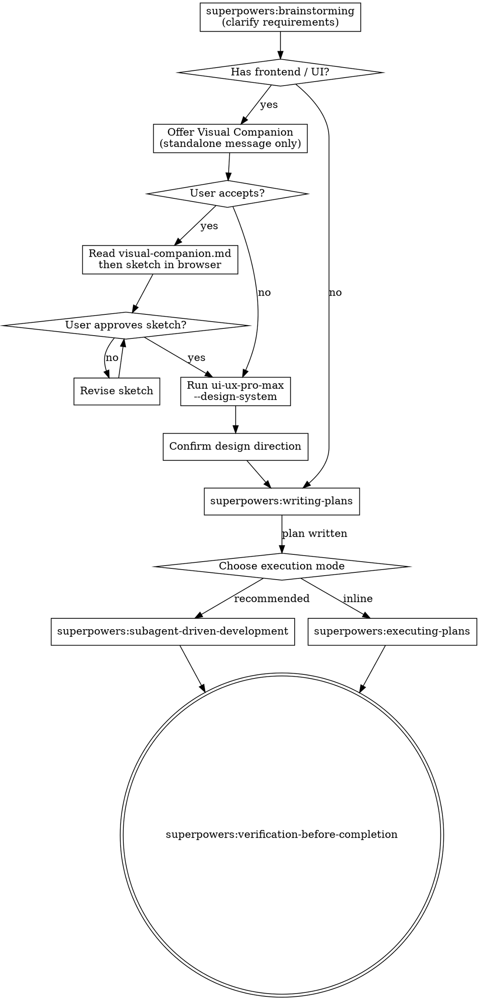

# Code Pilot

Universal development workflow. Routes frontend tasks through design-first process; all other tasks go directly to superpowers standard workflow.

## Route Decision



**Always start with brainstorming** — use multi-round questions to precisely understand requirements, constraints, and success criteria before taking any action.

**Frontend** = any task involving UI, components, pages, visual layout, design systems, or user-visible interfaces.

**Non-frontend** = backend logic, APIs, CLIs, scripts, databases, infrastructure, configuration, tests — skip directly to `superpowers:writing-plans` after brainstorming.

## Hard Gates

<HARD-GATE>
GATE 1 — ALL tasks: Do NOT proceed past brainstorming until requirements are fully clarified and user has confirmed understanding.

GATE 2 — Frontend tasks only: Do NOT write any implementation code until:
1. Visual Companion sketch has been presented and approved (or declined by user)
2. ui-ux-pro-max design system has been generated and confirmed
3. Implementation plan exists via superpowers:writing-plans
</HARD-GATE>

## Phase 1: Visual Companion Offer

When UI/visual work is involved, offer in a **standalone message — no other content**:

> "The interface we're about to design might be easier to communicate visually. I can sketch wireframes and mockups in the browser to confirm the layout before writing any code. Want to try? (requires opening a local URL)"

Wait for response before continuing.

**If accepted:** Read `skills/brainstorming/visual-companion.md` FIRST, then open the browser.

**Sketch deliverables:**
- Low-to-mid fidelity wireframe showing layout and component hierarchy
- 2 layout alternatives when structure is non-obvious
- Key interaction states annotated (hover, empty, error, loading)

**Decision rule:** Use browser for visual questions (layout, hierarchy, composition). Use text for conceptual questions (what content, what does this button do).

## Phase 2: ui-ux-pro-max Design System

After sketch approval (or if user skipped Visual Companion), run the design system generator:

```bash
# Step 1: Generate complete design system (ALWAYS start here)
python3 skills/ui-ux-pro-max/scripts/search.py "<product_type> <industry> <keywords>" --design-system -p "Project Name"

# Step 2: Persist design system for cross-session retrieval
python3 skills/ui-ux-pro-max/scripts/search.py "<query>" --design-system --persist -p "Project Name"

# Step 3: Detailed domain searches as needed
python3 skills/ui-ux-pro-max/scripts/search.py "<keyword>" --domain <domain>
# domains: product | style | color | typography | ux | chart | landing | google-fonts | react | web | prompt
```

Present the generated design system to the user and get explicit confirmation on:
- Visual style and color palette
- Typography (display font + body font)
- Key UX patterns to apply

## Phase 3: Implementation via Superpowers

Once design is confirmed:

1. **`superpowers:writing-plans`** — write implementation plan (TDD is baked into each task step)
2. **Choose execution mode** — `superpowers:subagent-driven-development` (recommended) or `superpowers:executing-plans`
3. **`superpowers:verification-before-completion`** — verify before claiming done

## Phase 4: Implementation Standards

Apply ui-ux-pro-max Pre-Delivery Checklist before every delivery:

**Visual Quality:** No emoji icons; consistent icon family; semantic color tokens (no hardcoded hex in components)

**Accessibility:** 4.5:1 contrast ratio; keyboard navigation; ARIA labels; alt text

**Touch & Interaction:** Min 44×44pt tap targets; 150–300ms micro-interactions; visible pressed states

**Layout:** Mobile-first; 4/8dp spacing rhythm; safe area compliance; no horizontal scroll

**Performance:** WebP/AVIF images; lazy loading; transform/opacity-only animations; virtualize lists 50+

**Forms:** Visible labels (not placeholder-only); inline validation on blur; error below field with recovery path

## Common Mistakes

| Mistake | Correct behavior |
|---------|-----------------|
| Code before sketch | Sketch (or skip with user consent) first |
| Skip --design-system step | Always generate design system before coding |
| Use placeholder-only labels on forms | Always use visible labels |
| Hardcode hex colors in components | Use semantic color tokens |
| Tests after implementation | TDD: tests first |
| Claim done without verification | Run superpowers:verification-before-completion |
| Combine Visual Companion offer with questions | Offer must be its own standalone message |
| Mix emoji and SVG icons | Pick one consistent icon system |

## Red Flags — Stop Immediately

- "This is too simple for a design system" → Run `--design-system` anyway
- "I'll write tests after the component works" → Delete code, start with TDD
- "The sketch looks fine" without user approval → Get explicit approval
- "Let me just start coding" → No. Plan first via superpowers:writing-plans

## Required Sub-Skills (invoke in order)

- **REQUIRED (all tasks):** `superpowers:brainstorming` — clarify requirements via multi-round dialogue before anything else; also provides Visual Companion mechanism for frontend tasks
- **REQUIRED (frontend only):** `ui-ux-pro-max` — design system generation via CLI
- **REQUIRED (all tasks):** `superpowers:writing-plans` — write implementation plan; TDD is baked into each task step; ends with execution mode choice
- **REQUIRED (all tasks):** `superpowers:subagent-driven-development` or `superpowers:executing-plans` — execute the plan (subagent recommended)
- **REQUIRED (all tasks):** `superpowers:verification-before-completion` — verify before claiming done
