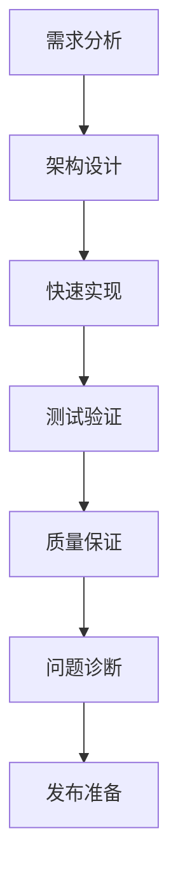

# Claude Code AI 代理新手使用手册

本手册基于最新的中文本地化支持版本编写，帮助新手快速上手 Claude Code AI 代理系统。

## 🚀 快速开始

### 第一步：了解基本概念
Claude Code AI 代理是一个智能化的软件开发助手，具有以下特点：
- **自主执行**：AI 会主动判断并执行任务，尽量减少确认步骤
- **专业分工**：不同领域的专家角色协同工作
- **中文友好**：完整的中文界面和指导

### 第二步：掌握核心原则
- **KISS**：保持简单直接
- **立即执行**：AI 会直接开始编辑现有文件
- **仅对重大变更确认**：只有影响广泛的变更才需要用户确认
- **优先现有内容**：优先编辑现有文件，而不是创建新文件

## 🛠️ 核心命令使用指南

### 主要工作流：`/requirements-pilot`
**最重要的命令**，自动化从需求到代码的完整流程：

```bash
# 基本用法
/requirements-pilot 实现用户登录功能

# 带测试
/requirements-pilot 实现用户登录功能 --test

# 不生成测试
/requirements-pilot 实现用户登录功能 --no-test
```

### 13个核心命令

#### 0. 屏幕截图分析：`/screenshot`
在 macOS 系统上截取屏幕并进行智能分析

> **⚠️ 系统要求**：仅支持 macOS 系统，Linux/Windows 用户需手动截图后提供文件路径。

```bash
# 选择窗口截图
/screenshot --window

# 全屏截图  
/screenshot --full

# 选择范围截图
/screenshot --crop
```

**特点**：
- 🖼️ 智能图像分析：UI/UX 评估、错误诊断、设计审查
- 🎯 针对性分析：可指定具体问题或评估角度
- 📊 多维度评估：界面一致性、可访问性、改进建议

**使用示例**：
```bash
# UI 问题分析
/screenshot --window
"分析这个界面的可用性问题"

# 错误信息诊断
/screenshot --crop  
"解释这个错误的原因和解决方案"

# 设计评估
/screenshot --full
"从 UX 角度评估整体设计"
```

#### 1. 技术咨询：`/ask`
向高级系统架构师咨询技术问题
```bash
/ask 应该选择 React 还是 Vue
/ask 微服务架构的最佳实践
```

**特点**：
- ⚡ 快速专业建议（2-5分钟）
- 🏛️ 架构导向，偏重技术选型和系统设计
- 📝 简洁明确的技术方案

#### 2. 功能分解：`/story-breakdown`
将复杂功能分解为可执行的小任务
```bash
/story-breakdown 实现一个完整的电商购物车系统
```

#### 3. 错误修复：`/bugfix`
系统化解决代码缺陷
```bash
/bugfix 用户登录后页面白屏
/bugfix API 响应时间过长
```

#### 4. 直接编码：`/code`
直接实现功能代码
```bash
/code 实现文件上传功能
/code 添加邮件验证功能
```

#### 5. 深度调试：`/debug`
使用 UltraThink 模式进行系统化调试
```bash
/debug 分析系统性能瓶颈
/debug 查找内存泄漏原因
```

#### 6. 性能优化：`/optimize`
专业的性能优化分析和实施
```bash
/optimize 提升页面加载速度
/optimize 优化数据库查询性能
```

#### 7. 代码审查：`/review`
多维度代码质量审查
```bash
/review src/components/
/review 整个登录模块
```

**特点**：
- 🏭 标准化流程：固定的4专家审查（质量、安全、性能、架构）
- 📝 代码专注：专门针对代码质量和实现
- ⚖️ 质量评分：给出具体的质量分数（目样90+）

#### 8. 测试策略：`/test`
智能测试策略制定和实施
```bash
/test 用户认证模块
/test API 端点测试
```

#### 9. 发布检查：`/release-check`
生产环境就绪验证
```bash
/release-check 用户管理系统
/release-check API 服务
```

**特点**：
- 🚀 发布导向：专注生产环境就绪检查
- ✅ 关键检查点：核心功能、错误处理、监控、回滚方案
- 🛡️ 风险控制：识别发布风险和缓解措施

### 高级分析命令

#### 10. 深度思考：`/ultrathink`
MECE 原则结构化深度分析
```bash
/ultrathink 选择微服务还是单体架构
/ultrathink 制定技术债务解决方案
```

**特点**：
- 🧠 系统性深度分析（10-20分钟）
- 🔍 多维度探讨（技术、业务、用户、风险）
- 📊 生成详细对比表和实施路径

#### 11. 多角色分析：`/multi-role`
多专家并行分析
```bash
# 基本用法
/multi-role security,performance 分析 API 安全性和性能

# 使用子代理并行执行（推荐大规模分析）
/multi-role architect,security,performance --agent 全面评估系统架构
```

**特点**：
- 🔄 灵活组合：可自由选择专业角色组合
- 🎯 针对性分析：可分析任何对象（代码、设计、系统等）
- 📊 对比权衡：生成专业观点对比和综合建议

#### 12. 角色辩论：`/role-debate`
专业角色间深度辩论和技术选型
```bash
# 架构选型辩论
/role-debate architect vs performance 单体架构vs微服务的性能考量

# 安全与性能权衡
/role-debate security vs performance JWT vs Session 认证方案选择

# 团队对抗辩论
/role-debate architect,security vs performance,qa 容器化部署策略辩论
```

**特点**：
- ⚖️ 对立论证：清晰展示不同专业观点的分歧和论据
- 🎯 技术选型：专门针对有争议的技术决策
- 📊 客观裁决：基于辩论过程提供平衡的最终建议
- 🏛️ 结构化过程：开题立论→交叉质辩→总结陈词→综合裁决

## 👥 专业角色库

### 5个核心专业角色

#### architect - 系统架构师
专注可扩展设计和技术决策
- 架构设计：微服务、单体、分布式系统
- 技术选型：基于业务需求的技术栈评估
- 系统集成：异构系统集成和 API 设计

#### security - 安全专家
专注威胁建模和防护策略
- 安全设计：认证、授权、加密
- 威胁分析：漏洞识别和风险评估
- 安全审计：代码和系统安全检查

#### performance - 性能专家
专注系统优化和瓶颈分析
- 性能监控：响应时间、吞吐量分析
- 瓶颈识别：CPU、内存、网络优化
- 扩展策略：水平和垂直扩展方案

#### frontend - 前端专家
专注现代 Web 应用和用户体验
- UI/UX 设计：界面可用性和可访问性
- 性能优化：首屏加载、资源优化
- 跨浏览器兼容：兼容性和响应式设计

#### qa - 质量保证专家
专注测试策略和质量管控
- 测试策略：单元测试、集成测试、端到端测试
- 质量标准：代码质量和最佳实践
- 自动化测试：CI/CD 和测试自动化

## 🎯 开发阶段工作流程

### 核心理念
- **质量门控自动化**：用客观标准替代主观判断
- **专业化分工**：每个工具专注一个领域，避免万能工具
- **轻量级流程**：保持简单，专注核心价值

### 完整开发流程（7个阶段）



#### 📋 阶段1：需求分析
**目标**：将模糊需求转化为可实现的用户故事

```bash
# 使用 /story-breakdown 工具
/story-breakdown "用户管理系统，包括注册、登录、权限管理"

# 质量门控标准：
# ✅ 每个故事都有明确的验收标准
# ✅ 故事大小适中（1-3天完成）
# ✅ 故事之间依赖关系清晰
```

#### 🏛️ 阶段2：架构设计
**目标**：在实现前明确技术方案和潜在风险

```bash
# 使用 /ask 工具进行架构咨询
/ask "高并发用户系统的架构设计考虑"
/ask "微服务vs单体架构在当前项目的选择"

# 使用 /role-debate 进行技术选型辩论
/role-debate architect vs performance "单体vs微服务的性能影响分析"
/role-debate security vs performance "安全性与性能的平衡选择"

# 质量门控标准：
# ✅ 技术方案清晰可行
# ✅ 主要风险已识别
# ✅ 技术选型经过充分论证
# ✅ 团队对方案达成共识
```

#### ⚡ 阶段3：快速实现
**目标**：将需求快速转化为工作代码

```bash
# 推荐：自动化流水线
/requirements-pilot "用户注册功能" --test
# 自动执行：需求确认(90+分) → 用户批准 → 代码实现 → 质量审查(90+) → 测试

# 或者：手动实现
/code "实现JWT认证中间件"

# 质量门控标准：
# ✅ 需求清晰度评分90+
# ✅ 代码质量评分90+
# ✅ 核心功能可验证
```

#### 🧪 阶段4：测试验证
**目标**：确保代码满足业务需求

```bash
# 使用 /test 创建智能测试策略
/test "用户认证模块"

# 智能测试决策：
# - UI变更：仅lint检查
# - 业务逻辑：全面测试
# - 1-5行修改：比例化测试

# 质量门控标准：
# ✅ 核心业务逻辑有测试覆盖
# ✅ 重要边界条件已验证
# ✅ 测试执行通过
```

#### 🔍 阶段5：质量保证
**目标**：确保代码达到生产标准

```bash
# 使用 /review 进行多维度审查
/review "用户管理模块"

# 4专家审查：
# ✅ 质量审计员：代码规范、可维护性
# ✅ 安全分析师：漏洞、权限控制  
# ✅ 性能审查员：性能瓶颈、优化点
# ✅ 架构评估员：设计模式、扩展性

# 质量门控标准：
# ✅ 代码质量评分90+
# ✅ 安全风险可控
# ✅ 性能满足要求
```

#### 🐛 阶段6：问题诊断
**目标**：系统化解决出现的问题

```bash
# 使用 /debug 进行UltraThink调试
/debug "生产环境响应超时"

# 4阶段调试流程：
# 问题分析 → 多专家协作 → 假设精炼 → 用户确认 → 实施修复

# 质量门控标准：
# ✅ 问题根因已确定
# ✅ 修复方案经过验证
# ✅ 用户确认后才实施
```

#### 🚀 阶段7：发布准备
**目标**：确保系统生产就绪

```bash
# 使用 /release-check 进行发布检查
/release-check "用户管理系统"

# 核心检查点：
# ✅ 核心功能正常
# ✅ 错误处理完善
# ✅ 监控日志就绪
# ✅ 回滚方案准备

# 质量门控标准：
# ✅ 生产就绪检查通过
# ✅ 回滚方案确认
# ✅ 监控告警配置
```

## 🔀 灵活使用模式

### 模式1：完整流程（新功能开发）
```bash
story-breakdown → ask → requirements-pilot → review → release-check
```

### 模式2：快速修复（Bug处理）
```bash
debug → code → review → release-check
```

### 模式3：架构优化（重构场景）
```bash
ask → code → test → review → release-check
```

### 模式4：一键完成（简单功能）
```bash
requirements-pilot（包含所有子流程）
```

## 💼 团队使用建议

### 新团队建议
1. **先用requirements-pilot**：完整体验自动化流程
2. **熟悉后拆解**：根据需要使用单独命令
3. **建立标准**：团队统一质量门控标准

### 复杂项目建议
1. **需求阶段必用**：story-breakdown + ask
2. **实现阶段灵活**：简单用requirements-pilot，复杂用code
3. **质量把控严格**：review + release-check必须过关

### 维护项目建议
1. **问题优先**：debug定位问题
2. **快速修复**：code直接实现
3. **质量保证**：review确保不引入新问题

## 💡 快速命令后缀

提升使用效率的智能后缀：

- `-u` = UltraThink 深度分析模式
- `-q` = 快速响应模式  
- `-d` = 详细调试模式
- `-m` = 多角色分析建议

```bash
# 示例用法
实现登录功能-u    # 启用深度思考模式
修复登录bug-d     # 启用详细调试模式
优化性能-m        # 启用多角色分析建议
```

## 🔄 工作完成标志

### 完全完成时的标志
当所有任务 100% 完成且没有后续任务时，系统会显示：
```text
活儿总算干完了,正好偷得浮生半日闲,饮杯茶去.
```

### 部分完成时的报告格式
```markdown
## 执行完成

### 变更内容
- [具体的变更点]

### 下一步
- [建议的下一步操作]
```

## 🚨 重要注意事项

### 立即执行（无需确认）
以下操作 AI 会自动执行：
- ✅ 修复错误、重构、性能改进
- ✅ 修改和更新现有文件
- ✅ 更新文档和规范
- ✅ 添加、更新、删除依赖包
- ✅ 实施测试

### 需要确认的操作
以下操作需要用户明确同意：
- ⚠️ 创建新文件
- ⚠️ 删除重要文件
- ⚠️ 结构性重大变更
- ⚠️ 外部集成（新 API、外部库）
- ⚠️ 安全功能实施
- ⚠️ 数据库模式变更
- ⚠️ 生产环境配置

### 质量保证原则
- **TDD 周期**：红色（失败）→ 绿色（成功）→ 重构（改进）
- **变更分离**：结构性变更和行为性变更分开提交
- **自动检查**：代码质量和一致性自动验证

### 智能自动化配置
💡 **高级用户提示**：可以参考 `settings.example` 中的 hooks 配置来设置自动化功能：

```bash
# 查看示例配置
cat .claude/settings.example
```

**主要 hooks 功能**：
- **Notification hooks**: 任务完成后自动通知
- **Stop hooks**: 任务停止时的自动化操作  
- **工作流增强**: 智能反馈和状态追踪

通过配置 hooks 可以实现：
- ✅ 自动任务状态通知
- ✅ 完成时的桌面提醒
- ✅ 与外部工具的集成
- ✅ 自定义工作流程增强

## 🎉 开始使用

### 新手入门路径

#### 第一步：简单尝试（5分钟）
```bash
# 技术咨询
/ask 如何优化我的项目性能

# 功能实现
/code 实现一个简单的计数器组件

# 多角色分析
/multi-role frontend,performance 分析我的用户界面

# 技术选型辩论
/role-debate security vs performance JWT vs Session 的选择
```

#### 第二步：体验完整流程（15分钟）
```bash
# 一键完整开发流程
/requirements-pilot 实现用户登录功能 --test
```

#### 第三步：掌握工作流（30分钟）
按照7阶段开发流程，完成一个小功能的完整实现。

### 选择合适的起点

- **完全新手**：从 `/requirements-pilot` 开始
- **有经验开发者**：从工作流程的任意阶段开始
- **团队负责人**：建议先了解质量门控标准

记住：AI 会自主判断并执行，你只需要提供清晰的需求描述即可！

## ❓ 常见疑问解答

### `/ask` vs `/ultrathink` 如何选择？

#### 使用 `/ask` 的场景
```bash
# ✅ 需要快速技术建议
/ask 高并发系统的缓存策略

# ✅ 架构设计咨询  
/ask 单体应用拆分微服务的步骤

# ✅ 技术选型建议
/ask GraphQL vs REST API 的选择
```

#### 使用 `/ultrathink` 的场景
```bash
# ✅ 重要决策需要深度分析
/ultrathink 是否应该重构整个认证系统

# ✅ 复杂权衡需要全面考虑
/ultrathink 团队从 5 人扩展到 20 人的策略

# ✅ 长期规划需要系统思考
/ultrathink PostgreSQL 迁移到 DynamoDB 的完整方案
```

#### 快速选择指南
| 需求 | 选择 | 时间 | 特点 |
|------|------|------|------|
| 专家意见 | `/ask` | 2-5分钟 | 直接建议 |
| 深度思考 | `/ultrathink` | 10-20分钟 | 系统分析 |

### 其他常见问题

### `/multi-role` vs `/role-debate` 如何选择？

#### 使用 `/multi-role` 的场景
```bash
# ✅ 需要多个专业角度的并行分析
/multi-role security,performance --agent "全面评估API性能和安全"

# ✅ 综合评估和改进建议
/multi-role architect,frontend,qa --agent "评估系统整体质量"

# ✅ 协同分析，寻找最佳实践
/multi-role performance,qa --agent "制定性能测试策略"
```

#### 使用 `/role-debate` 的场景  
```bash
# ✅ 技术选型存在明显争议
/role-debate architect vs performance "GraphQL vs REST API性能对比"

# ✅ 安全与其他目标存在权衡
/role-debate security vs frontend "用户体验vs数据安全的平衡"

# ✅ 需要深入论证技术决策
/role-debate architect,security vs performance,qa "微服务化的完整论证"
```

#### 快速选择指南
| 场景 | 选择 | 特点 |
|------|------|------|
| 协同分析 | `/multi-role` | 多角度综合建议 |
| 对立选择 | `/role-debate` | 深度论证决策 |
| 技术评估 | `/multi-role` | 全面客观评价 |
| 选型辩论 | `/role-debate` | 权衡利弊分析 |

### `/multi-role` 常见使用场景

#### 🎯 系统评估和设计审查
```bash
# 新系统架构评估
/multi-role architect,security,performance --agent "评估微服务化设计方案"

# API 设计审查
/multi-role security,performance --agent "审查用户认证 API 的设计"
```

#### 🔍 问题诊断和分析
```bash
# 性能问题综合诊断
/multi-role performance,architect --agent "分析系统响应缓慢的根本原因"

# 用户体验问题分析
/multi-role frontend,performance --agent "分析页面加载慢影响用户体验"
```

#### ⚖️ 技术选型决策
```bash
# 框架选择评估
/multi-role architect,frontend,performance --agent "React vs Vue 在当前项目的选择"

# 数据库技术选型
/multi-role architect,performance,qa --agent "PostgreSQL vs MongoDB 的技术选型"
```

#### 📱 按业务场景分类
```bash
# Web 应用场景
/multi-role security,frontend --agent "评估 Web 应用的前端安全措施"

# 移动应用场景
/multi-role frontend,performance,security --agent "全面评估移动应用质量"

# 系统架构场景
/multi-role architect,security,performance,qa --agent "全面评估微服务架构设计"
```

#### 🎭 推荐角色组合
```bash
# 双角色组合（效率最高）
security,performance    # 安全与性能双重分析
architect,security      # 架构安全设计
frontend,performance   # 界面性能优化

# 三角色组合（全面分析）
architect,security,performance  # 系统架构全面评估
frontend,performance,qa         # 前端质量全面检查

# 四角色组合（最全面）
architect,security,performance,qa  # 系统整体评估
```


**Q: `/multi-role` vs `/review` vs `/release-check` 如何选择？**

| 命令 | 适用阶段 | 主要用途 | 特点 |
|------|----------|--------|---------|
| `/multi-role` | 任何阶段 | 多角度综合分析 | 灵活组合专家 |
| `/review` | 开发阶段 | 代码质量审查 | 固定4专家流程 |
| `/release-check` | 发布前 | 生产就绪验证 | 发布风险检查 |

```bash
# 示例：同一功能的不同检查方式

# 1. 设计阶段 - 多角度评估
/multi-role architect,security,performance --agent "评估支付模块设计"

# 2. 开发完成 - 代码审查
/review src/payment/

# 3. 发布前 - 生产就绪检查
/release-check "支付模块"
```

**Q: 什么时候用 `/multi-role` 而不是其他命令？**
A: 当需要多个专业角度的独立评估时，比如同时需要安全和性能分析、设计阶段的多角度评估、复杂问题的跨领域诊断。

**Q: `/requirements-pilot` 和 `/code` 的区别？**
A: `/requirements-pilot` 是完整自动化流程，包含需求确认、代码实现、质量审查；`/code` 只做直接编码实现。

**Q: 如何选择合适的专业角色组合？**
A: 根据分析目标选择：安全相关用 `security`，性能相关用 `performance`，界面相关用 `frontend`。

## 📚 进阶学习

当你熟悉基本操作后，可以探索：
- 复杂的多角色组合分析
- UltraThink 深度思考模式
- 完整的项目开发工作流
- 高级性能优化策略

祝你使用愉快！🎊